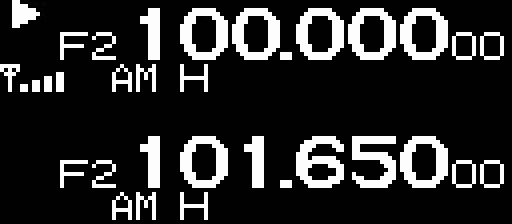

# UV_K5-Tools

some small tools for the Quansheng UV-K5 that some devs may find usefull

## ImageToCppHeader

converts a png (should also work with other formats) to a cpp header.
The screen buffer format is (where [x][y] are the coordinates on the screen):
- Byte 0 [0][0] to [0][7], 
- Byte 1 [1][0] to [1][7]
- ... 
- Byte 127 [127][0] to [127][7], 
- Byte 128 [0][8] to [0][15], 

## Screenmirror

copies the frame buffer using openocd and displays it using pygame. Reaches about 10fps, so more than enough
Saves every frame to an image, so it can be converted to a video
Thanks to [@fagci](https://github.com/fagci) for the spectrum mod

## CustomFW

should be a full FW in the future. Right now it only checks if extracted code compiles

## FwPatcher

compiles, links and patches the original FW with the extracted code. Also it saves symbols ;)
This means that an extracted function _F_ can be relocated if all functions which call _F_ are extracted as well.

# DO NOT FLASH without manually checking... It currently bricked my bootloader