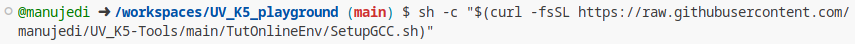
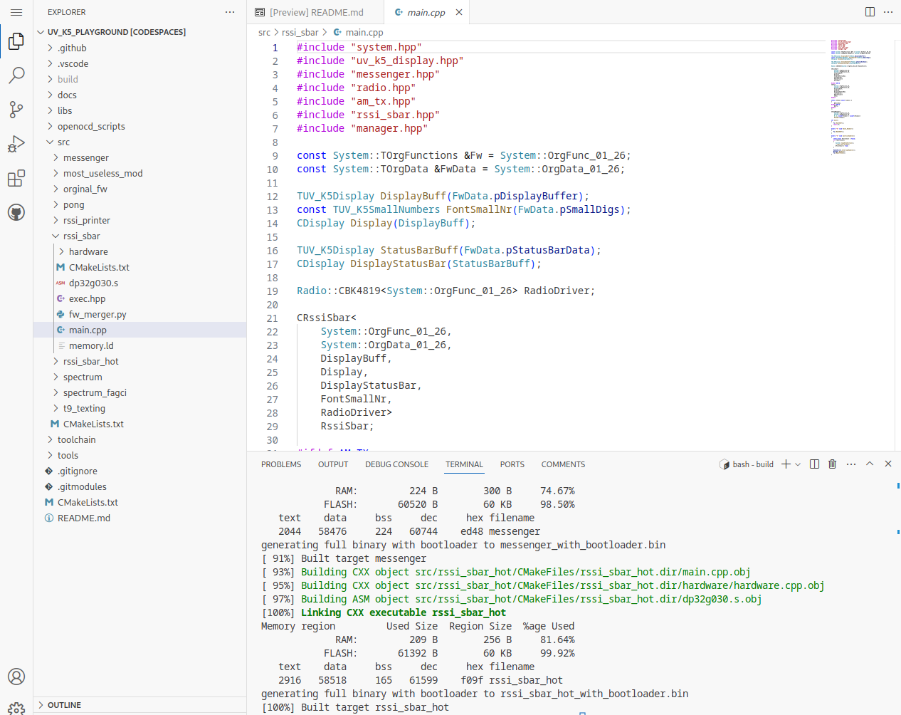

# Tutorial for building Piotr FW online
- ALL COMMANDS ARE RUN IN THE CODESPACE, nothing modifies you pc, don't run any command on your local pc
- you need a github account
- open your codespaces: https://github.com/codespaces
  - click on "New codespace"
    - Repository: piotr022/UV_K5_playground
    - Branch: main
    - Region/Machine type: Doesn't matter
- execute `sh -c "$(curl -fsSL https://raw.githubusercontent.com/manujedi/UV_K5-Tools/main/TutOnlineEnv/SetupGCC.sh)"` in the Terminal (or run the commands by hand to see what they do)

  - this takes some time (about 1min) 
  - your codespace should stop (if not select the codespace and press enter), click restart
  
- Build the FW (do not use `ninja`, replace `ninja` with `make`. Commands are similar to the ones in the README):
  - `mkdir build`
  - `cd build`
  - `cmake ..`
  - `make`
  - `make rssi_sbar_encoded`

You should have now a full development environment

